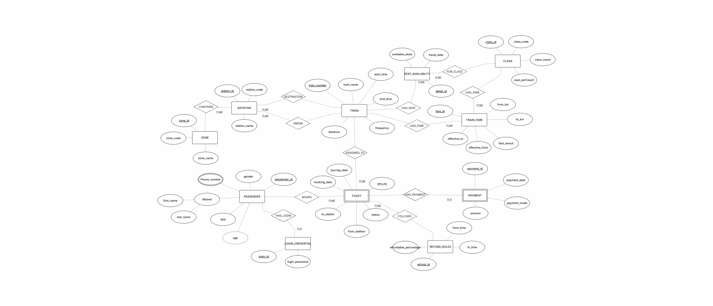

Problem Statement- This project aims to design and implement a Railway Ticketing Management System using DBMS concepts to ensure data consistency, reliability, and fast retrieval of information.

DAY1- Plannig of ui/ux