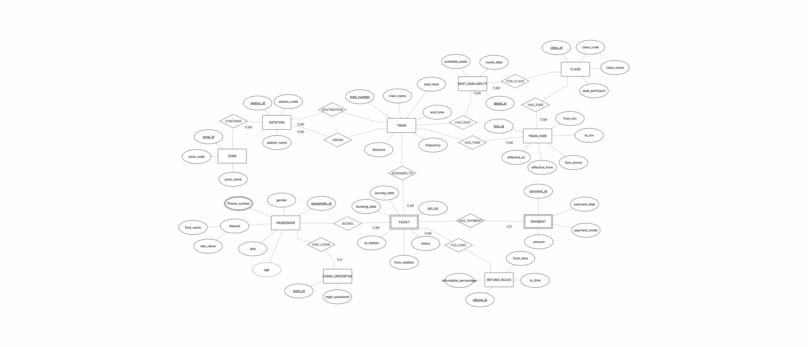

# 🚆 Rail Bandhu - Railway Ticketing Management System

> Revolutionizing the railway reservation experience with a modern, intelligent, and seamless platform.

## 📖 Overview

Traditional railway booking systems often suffer from outdated interfaces, confusing navigation, and a lack of intelligent routing. Users struggle to find connecting trains when direct routes are unavailable, leading to a frustrating and time-consuming booking experience.


**Rail Bandhu** introduces a sleek, user-centric interface coupled with a **Smart Connections** algorithm. It dynamically calculates multi-leg journeys, offering seamless connectivity suggestions and unified booking flows to ensure you reach your destination effortlessly. 

This project is built heavily utilizing modern **DBMS concepts** to ensure data consistency, reliability, and lightning-fast retrieval of information.

---

## ✨ Key Features

- **Intelligent Routing:** Smart Connections algorithm to suggest multi-leg journeys when direct routes are unavailable.
- **Hyper-Speed UI:** A seamless, single-page application experience with zero loading screens for instant searches.
- **Modern Aesthetic:** Indian art-inspired cyberpunk/vibrant dark mode UI featuring glassmorphism, Framer Motion animations, and responsive design.

- **Secure Bookings:** robust authentication and authorization using JWT-protected routes and secure DB triggers.
- **Total Control (Admin Dashboard):** Dedicated portal for administrators to manage trains, routes, and bookings effectively.
- **Live Search & Network Map:** Dynamic, real-time availability checking and booking flows.

---

## 🛠️ Tech Stack

### Frontend
- **React.js** (Component-based UI)
- **Tailwind CSS** (Utility-first styling & responsive layouts)
- **Framer Motion** (Complex animations and transitions)

### Backend & Database
- **Node.js & Express.js** (RESTful API architecture)
- **MongoDB** (NoSQL Database for flexible schema management)
- **Mongoose** (Object Data Modeling (ODM) library)
- **JSON Web Tokens (JWT)** (Secure user authentication)

---

## 🚀 Getting Started

Follow these instructions to set up the project locally.

### Prerequisites
- Node.js (v16 or higher)
- MongoDB instance (Local or Atlas)

### Installation

1. **Clone the repository**
   ```bash
   git clone <repository-url>
   cd "railway reservation"
   ```

2. **Backend Setup**
   ```bash
   cd server
   npm install
   ```
   *Create a `.env` file in the `server` directory and add your MongoDB URI and JWT Secret:*
   ```env
   MONGO_URI=your_mongodb_connection_string
   JWT_SECRET=your_jwt_secret
   ```
   *Start the backend server:*
   ```bash
   npm run dev
   ```

3. **Frontend Setup**
   ```bash
   cd ../client
   npm install
   ```
   *Start the frontend development server:*
   ```bash
   npm run dev
   ```

4. **Access the application**
   Open [http://localhost:5173](http://localhost:5173) in your browser.

---

## 🗄️ Database Entity Relationship Diagram (ERD)

Below is the ERD that maps out the DBMS structure ensuring data consistency and reliability across the platform.



---

## 👨‍💻 Contributors

This project was built and is maintained by:
- **Durgesh Narayan Nayak** - Core Contributor
- **Aditya Kumar Singh** - Core Contributor

---

<p align="center">
  <i>The Outdated Railway is Dead. Welcome to the GenZ Transit Revolution.</i>
</p>
